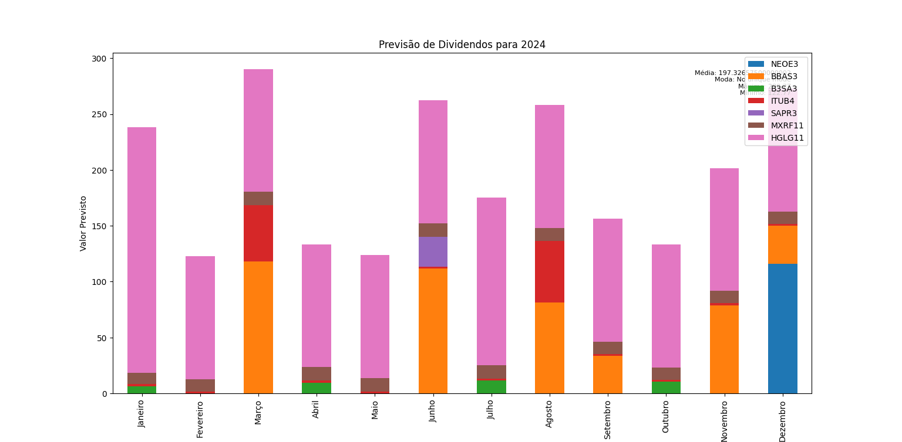

# Aplicativo de Análise de Ações

Este aplicativo executa várias funcionalidades relacionadas à análise de ações, incluindo previsão de dividendos, coleta de indicadores e aplicação de algoritmos de Bazin, Graham e a média dos dois ultimos algoritmos nos indicadores coletados.

## Utilização

O aplicativo é executado a partir da linha de comando e oferece as seguintes opções:

- `--previsao_dividendos`, `-pd`: Executa a previsão de dividendos para ações e FIIs. Antes de utilizar esta opção, é necessário ter os seguintes arquivos: `acoes.csv` e/ou `fiis.csv`.

- `--pegar_indicadores`, `-pi`: Coleta os indicadores das ações. Esta opção executa o script `pegar_indicadores.py`.

- `--algoritmos`, `-pa`: Executa os algoritmos de Bazin e Graham nos indicadores coletados. Para Bazin, é utilizado a fórmula `(LPA * PAYOUT/100) / 0.07`,para Graham é utilizado `(12 * LPA * VPA)` e para o metodo nathalia foi utilizado a média dos dois algoritmos anteriores.

- `--all`: Executa todas as opções disponíveis: previsão de dividendos, coleta de indicadores e execução dos algoritmos.

## Como Usar

1. Certifique-se de ter os arquivos `acoes.csv` e/ou `fiis.csv` com os dados das ações e FIIs.
2. Execute o script `main.py` passando as opções desejadas.

### Previsão de Dividendos

A previsão de dividendos é feita com base nos dados do ano anterior das ações e FIIs. O aplicativo gera um gráfico que mostra a distribuição dos dividendos por mês. Isso pode ajudar os investidores a planejar suas estratégias de investimento com base nas expectativas de renda passiva.




### Coleta de Indicadores 
Coleta os indicadores financeiros das ações e FIIs para análise posterior.
[Download do arquivo indicadores.csv](indicadores.csv)

### Algoritmos de Avaliação
Executa algoritmos de Bazin e Graham nos indicadores coletados, fornecendo insights sobre o potencial de valorização das ações.
[Download do arquivo valor_intrinseco.csv](valor_intrinseco.csv)

### Exemplos de Uso

- Executar a previsão de dividendos:

```bash
python main.py --previsao_dividendos
```

- Coletar os indicadores das ações:

```bash
python main.py --pegar_indicadores
```

- Executar os algoritmos de Bazin e Graham nos indicadores:

```bash
python main.py --algoritmos
```

- Executar todas as opções disponíveis:

```bash
python main.py --all
```

---


# Resultados

Os resultados estão sendo redirecionando para a pasta "arquivos" e lá possui a imagem da previsão de dividendos png e um arquivo html que demonstra qual é o possivel upgrade por tipo de algoritmo.